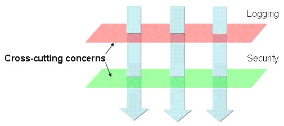

### 믹스인이란?
Mixin은 기능을 분리하여 재사용하는 패턴이다.  
믹스인은 특정 기능만을 담당하는 클래스로 단독 사용이 아닌 다른 클래스에 탑재되어 사용될 목적으로 작성된 클래스를 의미한다.
필요한 행위를 독립된 클래스로부터 얻어와 행위를 탑재할 수 있다면 훨씬 유연한 코드 재사용 패틴이 된다.


```js
// 나는 행위를 담당하는 Mixin
const FlyToMixin = (superclass) => class extends superclass {
    flyTo(destination){
        console.log(`${this.name} is flying to the ${destination}`);
    }
}

// 먹는 행위를 담당하는 Mixin
const EatMixin = (superclass) => class extends superclass {
    eat(food){
        console.log(`${this.name} is eating ${food}`);
    }
}

// 헤엄치는 행위를 담당하는 Mixin
const SwimAtMixin = (superclass) => class extends superclass {
    swimAt(place){
        console.log(`${this.name} is swiming at the ${place}`)
    }
}

```


```js
// 믹스인을 탑재한 Mouse
class Mouse extends SwimAtMixin(EatMixin(Animal)) { /*...*/ }

const mickyMouse = new Mouse('Micky Mouse');
mickyMouse.swimAt('river');
```

### 믹스인은 다중상속과 어떻게 다른가??


### 믹스인의 장점
OOP개발자가 적응하기 쉽다.
HOC는 함수형 사고방식에 익숙해져야한다.


### 믹스인의 단점
믹스인은 복잡하며 암묵적이며 충돌을 야기한다.

1. 의존성에 의한 유지보수 비용증가.
믹스인은 한 컴포넌트에 있는 파일이 아니기 때문에 종속성이 생기고, 문서화하기 어렵다. 왜냐하면 해당 코드를 찾으려는 개발자는 혼합된 믹스인을 다 찾아봐야 하기 때문이다.

2. 오버라이딩에 의한 충돌.  
타 패키지나, 믹스인 심지어 믹스인이 적용될 컴포넌트까지 메소드명이 충돌될 수 있다.
이를 해결하기위해 기존에 작성된 mixins는 제거하거나 변경하기가 어렵습니다.

3. 종속성에 의한 복잡도 증가.  
서로 종속되어 있는 믹스인을 수정하다보면 코드에 대한 복잡도가 증가한다.
이는 캡슐화 경계를 침식시킨다.  
믹스인의 기능을 확장하면서 점점 다른 믹스인이 생겨나게 되고, 결과적으로 믹스인들끼리는 강한 종속성이 생겨버린다. 


### HOC의 강점
1. HOC간의 종속성에서 자유롭기 때문에 충돌 가능성을 배재하고 있다.
2. 기존 컴포넌트의 코드를 보존할 수 있다.


### HOC의 단점.
Wrapper hell에 의한 컴포넌트 레이어의 복잡도 증가. 
렌더링에 대한 디버깅에 복잡도가 증가한다.


### 리액트는 Mixin에서 HOC를 사용하게 됐을까?
MixIn에 의한 코드 복잡도 증가로 인한 해결로 HOC를 선택함. 결합도를 낮추는것에 포커스를 맞춘 해결방법이라고 생각한다.


### 횡단 관심사란?(cross-cutting concerns)
구현하려고 하는 비즈니스 기능들을 Primary(Core) Concern라고 하며 보안, 로그, 인증과 같이 시스템 전반적으로 산재된 기능들을 Cross-cutting concern이라고 부른다.

